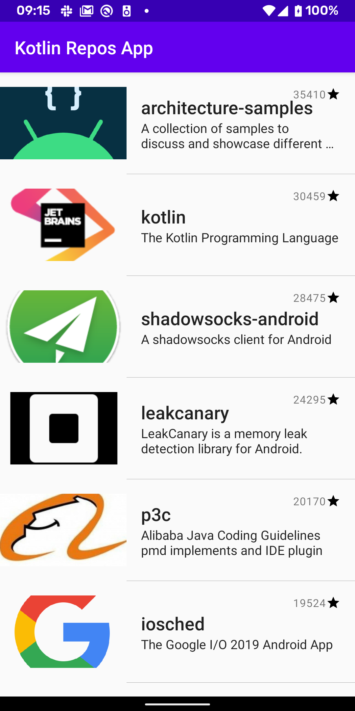
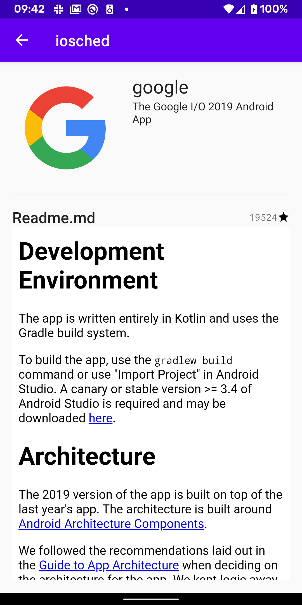
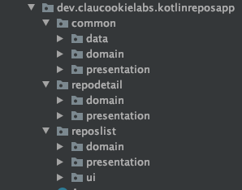
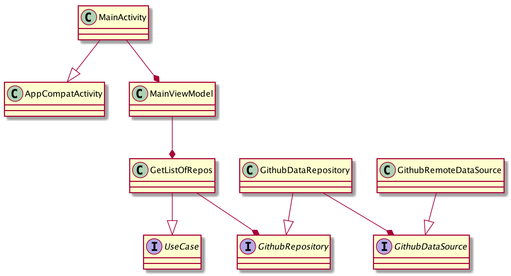

# kotlin-repos-android
This repo represents the implementation of a basic list-detail app created to display a list of trending Kotlin repos from github.

## Purpose
The purpose of this implementation is to play with Architecture Components and Koin.

## UI
| List                       | Detail                         |
| -------------------------- | ------------------------------ |
|  |  |

## Architecture and Implementation approach
I've decided to go for the presentation pattern `MVVM` and `Clean Architecture` to decouple layers and concerns as much as possible.

My goal was to separate the different features/modules: `common`, `list` and `detail` in feature modules but for now I just kept them in the main module applying the layers separation using packages.

If you would like to see a sample implementation with `MVP + CleanArch + Dagger2 + Feature modules`, feel free to go to this repo https://github.com/claucookie/android_lastfm_kotlin

The ViewModel has been implemented using `LiveData` and `Data Binding`.

## Tools

- Kotlin : https://kotlinlang.org/
- Android Jetpack Components : https://developer.android.com/jetpack
- Glide : https://github.com/bumptech/glide
- Retrofit 2 : https://github.com/square/retrofit
- Detekt : https://github.com/arturbosch/detekt
- Lottie : https://github.com/airbnb/lottie-android
- MarkdownView : https://github.com/falnatsheh/MarkdownView
- Koin : https://github.com/InsertKoinIO/koin

## Testing

No tests for now, they were not part of the exercise.